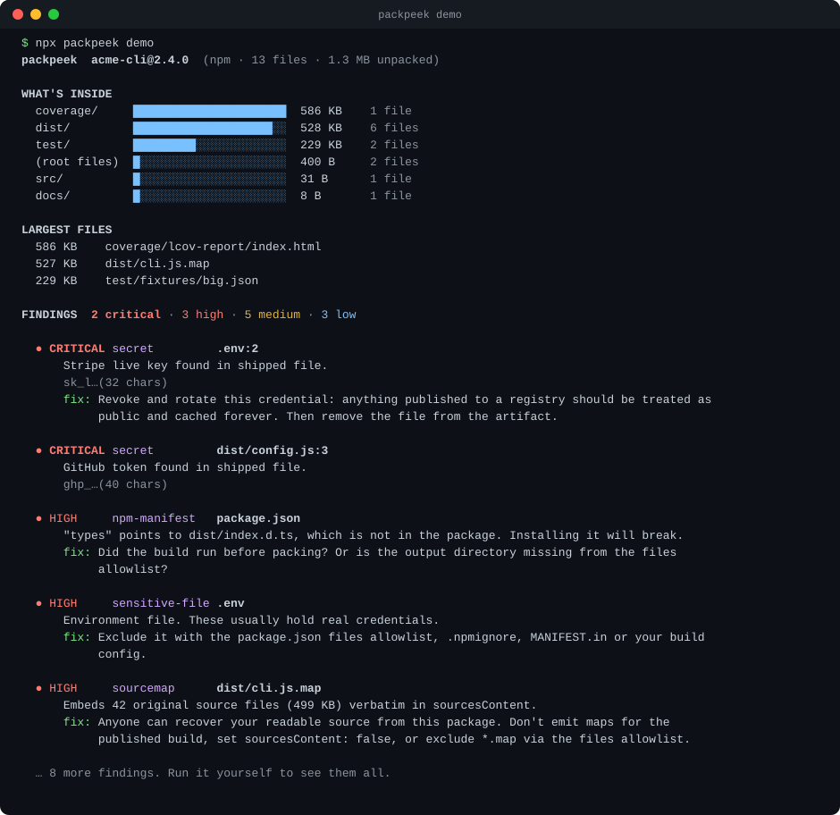
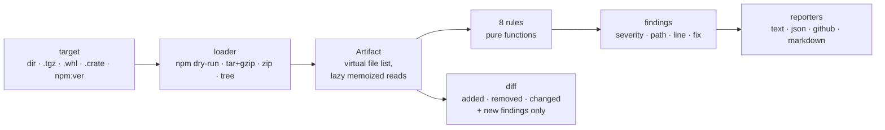

<div align="center">

# packpeek

**See what you are about to publish.**
Inspects the real npm tarball, Python wheel, sdist, crate or directory for source maps, secrets, `.env` files, baked-in home paths, broken entry points and size regressions.

[](https://github.com/Nithinfgs/packpeek/actions/workflows/ci.yml)
[](LICENSE)




</div>

## Try it in 10 seconds

```bash
npx github:Nithinfgs/packpeek demo
```

That generates a deliberately leaky package in a temp directory and inspects it. Nothing is published, nothing leaves your machine. When you are ready for the real thing:

```bash
cd your-package && npx github:Nithinfgs/packpeek
```

> **Install note.** packpeek is not on the npm registry yet. The command above builds it from this repo on first run (a few seconds). A prebuilt tarball is attached to each [GitHub release](https://github.com/Nithinfgs/packpeek/releases): `npx https://github.com/Nithinfgs/packpeek/releases/download/v0.1.0/packpeek-0.1.0.tgz`.

## The 20-second version

`npm pack --dry-run` shows you a file list. It does not tell you that one of those files embeds your entire source tree, that another has a live token in it, or that `"types"` in your `package.json` points at a file that is not in the tarball.

packpeek looks at **what actually ships**, not what you think ships:

- **npm project** → asks npm which files it would pack (`--dry-run --ignore-scripts`, so no scripts run), then reads them
- **`.tgz`, `.whl`, `.tar.gz` (sdist), `.crate`, `.zip`** → opens the archive directly, no extraction to disk
- **any directory** → treats it as a release tree (a static site `dist/`, an extracted Docker layer, a deploy folder)

and reports what is inside, largest first, followed by findings with a severity and a concrete fix. Exit code `1` when something is at or above `--fail-on` (default `high`), so it drops straight into CI.

## Why this exists

Publishing mistakes are mundane and expensive: a `.map` file with `sourcesContent`, a `.env` that was never in `.npmignore`, a `coverage/` directory, a wheel that installs a top-level `tests` package into everyone's `site-packages`. Registries are permanent and mirrored, so "I'll unpublish it" is not a plan. In March 2026 a source map shipped in an npm release of a widely used CLI exposed its source code ([The Register](https://www.theregister.com/2026/03/31/anthropic_claude_code_source_code/)).

Existing tools each cover a slice: secret scanners read your git tree (not what the package manager decided to include), `publint` checks `package.json` correctness, `npm pack --dry-run` lists files without judging them. packpeek is the one step between "build" and "publish" that looks at the finished artifact as a whole, across ecosystems, with no network and no dependencies.

## What it checks

| Rule | Catches |
|---|---|
| `sourcemap` | Maps that embed original source (`sourcesContent`), inline base64 maps, `sourceMappingURL` pointing at external hosts. Severity is lowered when the package declares an open-source license, since shipping maps is then usually deliberate |
| `secret` | GitHub / npm / PyPI / AWS / Stripe / Slack / Google / OpenAI / Anthropic keys, private key blocks, JWTs, and hard-coded credentials in config files. Values are redacted in every output format |
| `sensitive-file` | `.env*`, `.npmrc` with a token, `.pypirc`, SSH/TLS keys, `.git/`, `.aws/`, Terraform state, credential JSON, databases, logs, `.DS_Store` |
| `local-path` | `/Users/you/…`, `/home/you/…`, `C:\Users\you\…` baked into generated files (CI and placeholder users are ignored) |
| `npm-manifest` | `main` / `module` / `types` / `bin` / `exports` targets missing from the tarball, no `files` allowlist, install-time scripts |
| `python-layout` | Wheels that install top-level `tests`, `docs`, `examples`… packages |
| `unintended` | Tests, fixtures, CI config, lint configs, coverage output, caches, vendored `node_modules` in a package |
| `size` | Oversized files, identical duplicates, optional total-size budget |

Details, severities and the false-positive policy: [docs/rules.md](docs/rules.md).

## The feature worth knowing about: `packpeek diff`

A leak is usually a **change**: a new file that did not exist last release. Compare any two artifacts:

```bash
# last published version vs. what you are about to publish (needs network for the old side)
packpeek diff npm:1.4.2

# or two local artifacts
packpeek diff old.tgz new.tgz --max-growth 25
```

```
packpeek diff  acme-cli@2.3.0 → acme-cli@2.4.0

  size      728 B → 1.3 MB   +1.3 MB (1890× larger)
  files     6 → 13   +7 −0 ~2 changed

NEW FILES (largest first)
  + 586 KB    coverage/lcov-report/index.html
  + 527 KB    dist/cli.js.map
  + 229 KB    test/fixtures/big.json
    … and 4 more

NEW FINDINGS  2 critical · 2 high · 4 medium · 3 low
  …
```

(Real output from two packages built for the demo; findings list trimmed here.)

It reports added, removed and changed files, the size delta, and only the findings that are **new** in this version. `--max-growth` fails the build when a release balloons.

## Use it in CI

```yaml
- run: npm ci && npm run build
- run: npx github:Nithinfgs/packpeek#v0.1.0 --fail-on high --format github
```

`--format github` emits workflow annotations; `--format markdown` is suitable for a PR comment or `$GITHUB_STEP_SUMMARY`; `--format json` is stable for scripting. A full example is in [examples/github-workflow.yml](examples/github-workflow.yml).

Python, Rust and anything else:

```bash
python -m build && npx github:Nithinfgs/packpeek dist/*.whl
cargo package && npx github:Nithinfgs/packpeek target/package/*.crate
npx github:Nithinfgs/packpeek ./site-dist          # a static site, before you deploy it
```

## Usage

```
packpeek [target] [options]          Inspect an artifact (default: current directory)
packpeek diff <old> [new] [options]  Compare two artifacts
packpeek demo                        Inspect a deliberately leaky sample package
packpeek rules                       List the checks
```

| Option | |
|---|---|
| `--fail-on <level>` | `info` \| `low` \| `medium` \| `high` \| `critical` \| `none`. Default `high` |
| `--format <fmt>` / `--json` | `text` (default), `json`, `github`, `markdown` |
| `--ignore <rule[:glob]>` | Suppress a rule, optionally for matching paths only. Repeatable |
| `--rule <id>` | Run only this rule. Repeatable |
| `--max-file-size <size>` | Flag files above this (default `1mb`) |
| `--max-total-size <size>` | Flag artifacts above this unpacked size |
| `--max-growth <percent>` | `diff` only: fail if unpacked size grew more than this |
| `--pack` | npm projects: run a real `npm pack` (this executes `prepack`/`prepare`) instead of a dry run |
| `--verbose` | Also show info-level notes (e.g. install scripts) |

## Configuration

Optional `packpeek.config.json` in the working directory:

```json
{
  "failOn": "medium",
  "maxFileSize": "2mb",
  "maxTotalSize": "10mb",
  "ignore": [
    "unintended",
    { "rule": "sourcemap", "path": "dist/vendor/**" },
    "local-path:docs/**"
  ]
}
```

CLI flags override the file. Globs support `**`, `*`, `?` and `{a,b}`; a pattern without a slash matches the file name at any depth.

## How it works



- **Zero runtime dependencies.** Tar and zip parsing is a few dozen lines on `node:zlib`; archives are read in memory (up to 1 GB) and never extracted to disk.
- **Rules are pure functions** over an `Artifact`, one file each in [`src/rules/`](src/rules). Adding one is about 40 lines plus a test.
- **Offline.** The only network use is `npm:` specs in `diff`, and that is `npm pack` doing it.
- **Safe by default.** The dry run passes `--ignore-scripts`. Secret values are redacted (first four characters plus length) in text, JSON, markdown and annotations, and there is a test asserting the full token never appears in output.
- **Dogfooded.** CI packs this repository and runs packpeek against the tarball on every push.

## Limits, stated plainly

- Secret detection is **pattern-based**, anchored on vendor prefixes to keep noise low. It is not an entropy scanner and will miss unprefixed custom secrets. Use it alongside a secret scanner, not instead of one.
- Token counts and "likely intentional" judgements are **heuristics**. `sourcemap` severity depends on the declared license, which a package can get wrong.
- Not covered yet: Docker image layers (point it at an extracted tree), zip64 archives, Maven/Gradle/NuGet artifacts, signed-provenance checks.
- Python and crate **directory** targets need a built artifact: packpeek reads `dist/*.whl` / `.tar.gz` and does not run your build backend.

Validated while building it by running against real published npm tarballs and Python wheels and tuning out false positives (docstring example paths, open-source libraries that ship maps on purpose, per-file noise from d.ts maps). If you find another, the [false-positive template](https://github.com/Nithinfgs/packpeek/issues/new?template=false_positive.yml) is the fastest way to get it fixed.

## Roadmap

- [ ] Publish to the npm registry (`npx packpeek`)
- [ ] Docker image tarball (`docker save`) support
- [ ] SARIF output for code-scanning UIs
- [ ] `--baseline` file so existing findings do not fail old projects
- [ ] zip64 and Maven/NuGet artifact support
- [ ] Optional entropy-based secret rule (off by default)

## Contributing

Bug reports with a minimal artifact are gold. New rules are welcome; read [CONTRIBUTING.md](CONTRIBUTING.md) first (short). Security issues: see [SECURITY.md](SECURITY.md).

```bash
git clone https://github.com/Nithinfgs/packpeek && cd packpeek
npm ci && npm test
```

## License

[MIT](LICENSE)
